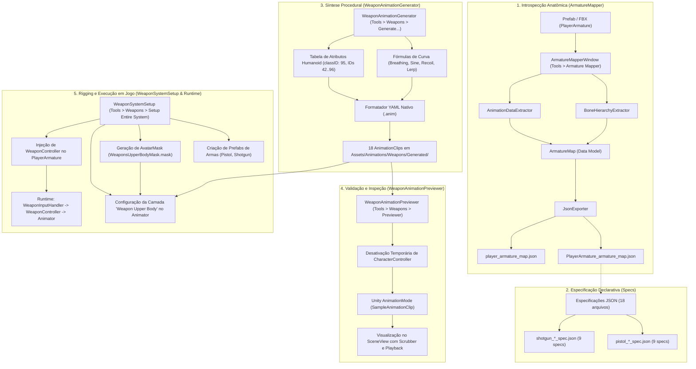
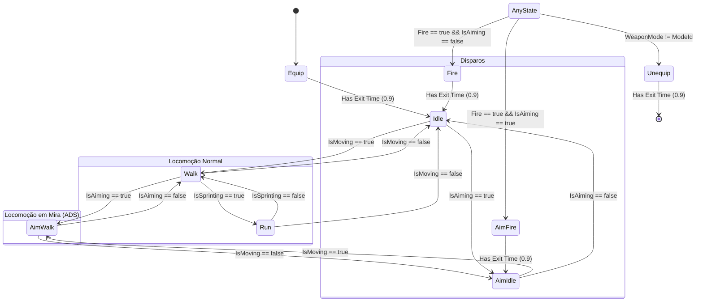

# 🎬 Arquitetura e Implementação do Sistema de Criação de Animações (ScaryParty)

Este documento apresenta uma análise técnica profunda e exaustiva de todo o ecossistema de **criação, mapeamento, especificação, síntese procedural e integração de animações** desenvolvido para o projeto *ScaryParty*.

O módulo foi concebido para dotar o personagem jogável (`PlayerArmature`) de um sistema completo de armas de fogo (Pistola e Escopeta) com 18 animações exclusivas geradas proceduralmente em curvas musculares Humanoid do Unity, eliminando a dependência de softwares de modelagem 3D externos (como Blender ou Maya) ou gravações manuais de mocap durante o desenvolvimento iterativo.

---

## 1. Visão Geral e Filosofia do Sistema

### O Desafio
O projeto *ScaryParty* utiliza o pacote *StarterAssets ThirdPersonController* da Unity. Por padrão, esse pacote fornece animações básicas de locomoção corporal inteira (Idle, Walk, Run, Jump, Fall). Integrar combate com armas de fogo apresentava três grandes gargalos técnicos:
1. **Divergência de Poses e Rigging:** Animações baseadas em coordenadas de `Transform` locais (`localPosition` e `localRotation`) quebram facilmente quando o rig do modelo é reimportado, escalado ou substituído, além de serem propensas a *gimbal lock* e deformações indesejadas em avatares humanoides distintos.
2. **Dependência de Criação Manual Externa:** Criar 18 estados de animação distintos para duas armas diferentes diretamente em ferramentas DCC (Blender) para testes de prototipagem rápida consome dezenas de horas de trabalho artístico.
3. **Isolamento da Parte Superior do Corpo (*Layer Blending*):** As armas exigem que o tronco, cabeça e braços executem poses de empunhadura, mira e recuo balístico, enquanto as pernas e a pelve continuam executando livremente a marcha ou corrida base do `StarterAssets`.

### A Solução Arquitetural
Para solucionar esses desafios, foi arquitetada uma **esteira procedural de animação em 5 fases integradas**:

```
[ 1. ArmatureMapper ] ──> Gera Raio-X em JSON (Hierarquia, Bones, IDs de Músculo)
         │
         ▼
[ 2. Specs JSON ]     ──> Documentos declarativos de cada clipe (intenção, timing, poses)
         │
         ▼
[ 3. AnimationGen ]   ──> Sintetizador matemático que escreve arquivos .anim (YAML nativo)
         │
         ▼
[ 4. Previewer ]      ──> Editor Window com scrubbing e sampling em tempo real (sem PlayMode)
         │
         ▼
[ 5. Setup & Runtime] ──> Montagem automatizada do Animator Controller, AvatarMask e WeaponController
```

---

## 2. Diagrama de Arquitetura e Fluxo de Execução

O diagrama abaixo ilustra o fluxo completo desde a extração dos dados anatômicos até a execução das armas na cena do jogo:



---

## 3. Módulo 1: Introspecção e Mapeamento (`ArmatureMapper`)

Localizado em [`Assets/ArmatureMapper/`](file:///d:/Arquivos/Documentos/GitHub/ScaryParty/ScaryParty/Assets/ArmatureMapper), este submódulo é responsável por fazer a **engenharia reversa e radiografia completa** de qualquer prefab ou modelo do projeto.

### 3.1. Arquitetura de Classes

```
Assets/ArmatureMapper/
├── Editor/
│   ├── ArmatureMapperModels.cs       # Modelos serializáveis do relatório
│   ├── BoneHierarchyExtractor.cs     # Varredura recursiva de nós, transforms e malhas
│   ├── AnimationDataExtractor.cs     # Extração de states, blendtrees e keyframes
│   ├── JsonExporter.cs               # Serialização e salvamento em disco
│   └── ArmatureMapperWindow.cs       # Interface visual no Editor (Tools > Armature Mapper)
└── Output/
    ├── player_armature_map.json      # Mapeamento do modelo FBX original
    └── PlayerArmature_armature_map.json # Mapeamento completo com 226k linhas do prefab
```

#### Detalhamento das Classes

1. [`ArmatureMapperModels.cs`](file:///d:/Arquivos/Documentos/GitHub/ScaryParty/ScaryParty/Assets/ArmatureMapper/Editor/ArmatureMapperModels.cs):
   - `ArmatureMap`: Estrutura raiz contendo metadados do prefab (`PrefabInfo`), árvore hierárquica (`List<BoneNode>`), dados de renderers (`List<SkinnedMeshInfo>`), estrutura do Animator (`AnimatorInfo`) e dados analíticos de animações (`List<AnimationClipData>`).
   - `BoneNode`: Representa cada nó do esqueleto. Armazena o nome, caminho calculado (`AnimationUtility.CalculateTransformPath`), posição local/global, rotação local/global (Euler), escala, profundidade na árvore (`depth`) e a lista de componentes anexados.
   - `SkinnedMeshInfo`: Captura o nome da malha, nomes dos materiais associados, lista de nomes de bones que influenciam a malha, `rootBoneName`, blend shapes e o bounding box local.
   - `AnimatorInfo` e `AvatarInfo`: Mapeia o nome e caminho do `AnimatorController`, lista de parâmetros tipados, camadas (`AnimatorLayerInfo`), estados (`AnimatorStateInfo`), transições e a tabela oficial de correspondência humanoide (`HumanBoneMapping`), mapeando bones padrão do Mecanim (ex: `RightUpperArm`, `Spine`) para a nomenclatura do rig do modelo (ex: `Right_UpperArm`, `Spine`).
   - `AnimationClipData` e `CurveBindingData`: Extrai todos os bindings de curva existentes, taxas de amostragem, tempos de chave (`time`), valores (`value`), inclinações de tangente (`inTangent`, `outTangent`) e pesos ponderados (`inWeight`, `outWeight`).

2. [`BoneHierarchyExtractor.cs`](file:///d:/Arquivos/Documentos/GitHub/ScaryParty/ScaryParty/Assets/ArmatureMapper/Editor/BoneHierarchyExtractor.cs):
   - Percorre a árvore de Transforms de forma recursiva através do método `ProcessTransform`.
   - Utiliza `AnimationUtility.CalculateTransformPath(current, root)` para garantir que as strings de caminho correspondam com precisão ao formato exigido pelas curvas de animação do Unity.
   - Coleta todos os `SkinnedMeshRenderer`s ativos ou inativos via `GetComponentsInChildren<SkinnedMeshRenderer>(true)`.

3. [`AnimationDataExtractor.cs`](file:///d:/Arquivos/Documentos/GitHub/ScaryParty/ScaryParty/Assets/ArmatureMapper/Editor/AnimationDataExtractor.cs):
   - Acessa o `Animator` e resolve o `AnimatorController` efetivo (tratando casos de `AnimatorOverrideController`).
   - Mapeia parâmetros (Float, Int, Bool, Trigger) e seus valores padrão.
   - Navega recursivamente pelas máquinas de estado (`AnimatorStateMachine`), incluindo sub-máquinas de estado e Blend Trees aninhadas, coletando clipes únicos em um `HashSet<AnimationClip>`.
   - Extrai curvas editoriais através de `AnimationUtility.GetCurveBindings(clip)` e `AnimationUtility.GetEditorCurve(clip, binding)`.

4. [`JsonExporter.cs`](file:///d:/Arquivos/Documentos/GitHub/ScaryParty/ScaryParty/Assets/ArmatureMapper/Editor/JsonExporter.cs):
   - Converte o objeto `ArmatureMap` para string formatada via `JsonUtility.ToJson(map, true)`.
   - Salva o arquivo em `Assets/ArmatureMapper/Output/<SafeName>_armature_map.json`.
   - Invoca `AssetDatabase.Refresh()` e destaca o arquivo no painel de projeto via `EditorGUIUtility.PingObject`.

5. [`ArmatureMapperWindow.cs`](file:///d:/Arquivos/Documentos/GitHub/ScaryParty/ScaryParty/Assets/ArmatureMapper/Editor/ArmatureMapperWindow.cs):
   - Janela de editor acessada em `Tools > Armature Mapper`.
   - Permite arrastar o Prefab alvo ou capturar a seleção atual da cena.
   - Exibe status informativo imediato (presença de Animator e SkinnedMeshRenderer).
   - Oferece toggles para extração seletiva de Hierarquia, SkinnedMesh e Animações (Keyframes).
   - Emite barra de progresso síncrona com `EditorUtility.DisplayProgressBar`.

### 3.2. Os Documentos JSON de Saída

- [`player_armature_map.json`](file:///d:/Arquivos/Documentos/GitHub/ScaryParty/ScaryParty/Assets/ArmatureMapper/Output/player_armature_map.json): Mapeamento limpo extraído do arquivo de malha bruto `player.fbx` (72 bones, 74 componentes).
- [`PlayerArmature_armature_map.json`](file:///d:/Arquivos/Documentos/GitHub/ScaryParty/ScaryParty/Assets/ArmatureMapper/Output/PlayerArmature_armature_map.json): Arquivo maciço (~11.7 MB, 226.744 linhas) contendo todos os componentes do prefab de gameplay (`CharacterController`, `NetworkObject`, `ThirdPersonController`, `ClientNetworkTransform`, etc.) e a extração completa de todos os keyframes originais de locomoção do Unity StarterAssets.

> [!IMPORTANT]
> **A Descoberta dos Muscle IDs:**
> Foi através da análise do `PlayerArmature_armature_map.json` que a equipe obteve os identificadores numéricos exatos de atributo humanoide (`attribute: ID` sob `classID: 95`) usados internamente pelo Unity Mecanim, viabilizando o gerador procedural de arquivos `.anim`.

---

## 4. Módulo 2: Especificações Declarativas das Animações (`Specs/`)

Localizado em [`Assets/Animations/Weapons/Specs/`](file:///d:/Arquivos/Documentos/GitHub/ScaryParty/ScaryParty/Assets/Animations/Weapons/Specs), este diretório contém **18 arquivos JSON de especificação** formal para cada estado de animação das armas:

### 4.1. Catálogo de Arquivos de Especificação

| Arma | Arquivo de Especificação (.json) | Clipe Gerado Correspondente | Tipo | Duração |
| :--- | :--- | :--- | :--- | :--- |
| **Pistola** | `pistol_Idle_spec.json` | `Pistol_Idle.anim` | Loop | 2.0s |
| **Pistola** | `pistol_Walk_spec.json` | `Pistol_Walk.anim` | Loop | 0.8s |
| **Pistola** | `pistol_Run_spec.json` | `Pistol_Run.anim` | Loop | 0.6s |
| **Pistola** | `pistol_AimIdle_spec.json` | `Pistol_AimIdle.anim` | Loop | 1.0s |
| **Pistola** | `pistol_AimWalk_spec.json` | `Pistol_AimWalk.anim` | Loop | 0.8s |
| **Pistola** | `pistol_Fire_spec.json` | `Pistol_Fire.anim` | One-Shot | 0.3s |
| **Pistola** | `pistol_AimFire_spec.json` | `Pistol_AimFire.anim` | One-Shot | 0.25s |
| **Pistola** | `pistol_Equip_spec.json` | `Pistol_Equip.anim` | One-Shot | 0.5s |
| **Pistola** | `pistol_Unequip_spec.json` | `Pistol_Unequip.anim` | One-Shot | 0.4s |
| **Escopeta** | `shotgun_Idle_spec.json` | `Shotgun_Idle.anim` | Loop | 2.0s |
| **Escopeta** | `shotgun_Walk_spec.json` | `Shotgun_Walk.anim` | Loop | 0.8s |
| **Escopeta** | `shotgun_Run_spec.json` | `Shotgun_Run.anim` | Loop | 0.6s |
| **Escopeta** | `shotgun_AimIdle_spec.json` | `Shotgun_AimIdle.anim` | Loop | 1.0s |
| **Escopeta** | `shotgun_AimWalk_spec.json` | `Shotgun_AimWalk.anim` | Loop | 0.8s |
| **Escopeta** | `shotgun_Fire_spec.json` | `Shotgun_Fire.anim` | One-Shot | 0.5s |
| **Escopeta** | `shotgun_AimFire_spec.json` | `Shotgun_AimFire.anim` | One-Shot | 0.45s |
| **Escopeta** | `shotgun_Equip_spec.json` | `Shotgun_Equip.anim` | One-Shot | 0.7s |
| **Escopeta** | `shotgun_Unequip_spec.json` | `Shotgun_Unequip.anim` | One-Shot | 0.5s |

### 4.2. Anatomia do Esquema JSON de um Spec

Cada arquivo de especificação segue um padrão estruturado em três seções:

```json
{
  "meta": {
    "clipName": "Pistol_Idle",
    "animationName": "Pistol_Idle",
    "targetPrefab": "PlayerArmature",
    "outputPath": "Assets/Animations/Weapons/Pistol_Idle.anim",
    "tPoseReference": "PlayerArmature_armature_map.json",
    "bonePathPrefix": "Skeleton/",
    "duration": 2.0,
    "frameRate": 30,
    "isLooping": true,
    "wrapMode": "Loop",
    "description": "Low ready: pistola apontada ~30 graus pra frente-baixo. Respiracao leve no Chest"
  },
  "keyPoses": [
    {
      "poseName": "Initial_Pose",
      "time": 0.0,
      "description": "Pose inicial low-ready",
      "boneTargets": [
        {
          "bonePath": "Skeleton/Hips/Spine/Chest/UpperChest/Right_Shoulder/Right_UpperArm",
          "targetLocalRotation": { "x": 0.0, "y": 0.0, "z": 0.0 },
          "note": "Alinhamento com empunhadura"
        }
      ]
    }
  ],
  "animatedBones": [
    {
      "boneName": "Right_UpperArm",
      "bonePath": "Skeleton/Hips/Spine/Chest/UpperChest/Right_Shoulder/Right_UpperArm",
      "animatePosition": false,
      "animateRotation": true,
      "tPoseLocalPosition": { "x": 0.167, "y": 0.0, "z": 0.0 },
      "tPoseLocalRotation": { "x": 0.0, "y": 0.0, "z": 0.0 },
      "role": "Posicionamento do braço em empunhadura",
      "keyframes": [
        {
          "time": 0.0,
          "localRotation": { "x": 0.0, "y": 0.0, "z": 0.0 }
        }
      ]
    }
  ]
}
```

- **Papel na Arquitetura:** Esses documentos operam como a especificação de engenharia que documenta a intenção de animação e o rig de ossos, garantindo rastreabilidade antes da síntese matemática das curvas.

---

## 5. Módulo 3: Geração Procedural de Animações (`WeaponAnimationGenerator`)

Implementado em [`Assets/Editor/WeaponAnimationGenerator.cs`](file:///d:/Arquivos/Documentos/GitHub/ScaryParty/ScaryParty/Assets/Editor/WeaponAnimationGenerator.cs), este é o **motor central** responsável por fabricar os 18 arquivos de animação `.anim` finais.

### 5.1. A Convenção de Músculos Humanoides do Unity

Em vez de animar Transforms brutos (que causam quebra ao trocar de modelo ou retargeting), o gerador opera exclusivamente no **Espaço Muscular Normalizado do Unity Mecanim**. No Unity Humanoid, cada articulação é controlada por valores nominais entre `[-1.0, +1.0]`:

| Eixo / Músculo | Valor `-1.0` | Valor `0.0` (Referência) | Valor `+1.0` |
| :--- | :--- | :--- | :--- |
| **Down-Up (Braço/Perna)** | Membro abaixado junto ao corpo | Esticado na horizontal (T-Pose) | Erguido acima da cabeça |
| **Front-Back (Braço)** | Braço estendido para trás das costas | Ao lado do corpo (T-Pose) | Braço apontado à frente do peito |
| **Forearm Stretch** | Cotovelo hiperdobrado (mão encosta no ombro) | Dobrado em ângulo neutro | Cotovelo 100% estendido e reto |
| **Hand Down-Up** | Pulso flexionado para baixo | Pulso neutro alinhado | Pulso estendido para cima |
| **Spine Front-Back** | Coluna inclinada para trás (extensão) | Tronco ereto neutro | Coluna curvada para frente (flexão) |
| **Spine / Chest Left-Right** | Torção/inclinação para a esquerda | Neutro frontal | Torção/inclinação para a direita |

### 5.2. Mapeamento de Atributos e IDs

O gerador associa o nome da propriedade muscular com o ID numérico registrado no Unity (`classID: 95` para o componente `Animator`):

```csharp
private static readonly (string name, int id)[] MuscleMap =
{
    ("Spine Front-Back",       42),
    ("Spine Left-Right",       90),
    ("Chest Front-Back",       93),
    ("Chest Left-Right",       95),
    ("Head Nod Down-Up",       81),
    ("Head Tilt Left-Right",   84),
    ("Right Arm Down-Up",      43),
    ("Right Arm Front-Back",   45),
    ("Right Arm Twist In-Out", 46),
    ("Right Forearm Stretch",  54),
    ("Right Hand Down-Up",     55),
    ("Right Hand In-Out",      91),
    ("Left Arm Down-Up",       92),
    ("Left Arm Front-Back",    96),
    ("Left Arm Twist In-Out",  82),
    ("Left Forearm Stretch",   83),
};
```

### 5.3. Calibração das Poses Base (`MusclePose`)

As poses foram calibradas matematicamente para atingir posturas de combate realistas:

1. **Pistola - Low Ready (`PistolIdlePose`):**
   - Braço direito levemente abaixado (`RightArmDownUp = -0.25f`) e empurrado para frente (`RightArmFrontBack = 0.45f`).
   - Cotovelo dobrado em ~90° (`RightForearmStretch = -0.45f`).
   - Braço esquerdo desce relaxado naturalmente ao lado do corpo (`LeftArmDownUp = -0.55f`).
2. **Pistola - Mirando ADS (`PistolAimPose`):**
   - Ambos os braços projetados para frente (`RightArmFrontBack = 0.80f`, `LeftArmFrontBack = 0.78f`).
   - Braços quase totalmente estendidos (`RightForearmStretch = 0.25f`, `LeftForearmStretch = 0.20f`).
   - Braço esquerdo rotacionado (`LeftArmTwistInOut = 0.30f`) para simular a empunhadura do copo com as duas mãos.
   - Cabeça e coluna ligeiramente inclinadas para frente para focar nas miras (`HeadNodDownUp = 0.10f`, `SpineFrontBack = 0.10f`).
3. **Escopeta - Port Arms (`ShotgunIdlePose`):**
   - Braço direito bem recolhido junto às costelas sustentando a coronha (`RightForearmStretch = -0.62f`, `RightArmDownUp = -0.22f`).
   - Braço esquerdo avançado sustentando o guarda-mão/cano (`LeftArmFrontBack = 0.55f`, `LeftForearmStretch = -0.32f`).
4. **Escopeta - Mirando ADS (`ShotgunAimPose`):**
   - Postura assimétrica: ombro direito levantado (`RightArmDownUp = -0.10f`), cotovelo em postura tática.
   - Inclinação e torção de cabeça (*cheek weld* na coronha): `HeadTiltLeftRight = 0.12f`, `ChestLeftRight = -0.12f`.
5. **Coldre / Posição de Saque (`HolsterPose`):**
   - Braço direito estendido para baixo ao lado do quadril (`RightArmDownUp = -0.78f`, `RightArmFrontBack = -0.05f`).

### 5.4. Sintetizadores de Curvas Matemáticas

O gerador sintetiza diferentes dinâmicas temporais para cada comportamento:

1. **Curva de Respiração (`BreathingCurve`):**
   - Aplica uma oscilação suave de 3 pontos no peitoral (`Chest Front-Back`), criando a sensação orgânica de respiração contínua sem que a arma pareça congelada no espaço.
2. **Curva Senoidal de Passada (`SineCurve`):**
   - Gera uma onda senoidal de 8 passos (`Mathf.Sin(2 * PI * t + phase) * amp`).
   - Aplica oscilações com defasagem de fase de 180° (`Mathf.PI`) entre o braço direito e o esquerdo, harmonizando com o movimento de caminhada e corrida da parte inferior do corpo.
3. **Curva Balística de Recuo (`RecoilCurve`):**
   - Modela fisicamente o disparo de arma de fogo em duas fases:
     - **Rampa de Subida (Impulso Instantâneo):** Ocorre nos primeiros 18% da duração (`peakT = dur * 0.18f`), com tangente extremamente íngreme (`ramp = recoilMag / peakT`). O cano sobe, os cotovelos estendem e o pulso estala para cima.
     - **Decaimento Suave (Recuperação):** Nos 82% restantes do tempo, a postura retorna gradualmente à posição original com desaceleração exponencial (`decay = -recoilMag / (dur - peakT)`).
4. **Curva de Transição de Empunhadura (`LerpCurve`):**
   - Utilizada em `Equip` e `Unequip` para criar uma interpolação fluida com aceleração suave (*ease-in* no saque e *ease-out* no coldreamento).

### 5.5. O Serializador Nativo em YAML Unity (.anim)

Em vez de depender de chamadas instáveis da API do Unity Editor para salvar clipes (como instanciar objetos no modo de gravação do AnimationWindow), o método `WriteClip` escreve diretamente o arquivo de texto em formato nativo YAML da Unity (`%YAML 1.1`, tag `!u!74 &7400000`):

```yaml
%YAML 1.1
%TAG !u! tag:unity3d.com,2011:
--- !u!74 &7400000
AnimationClip:
  m_ObjectHideFlags: 0
  m_Name: Pistol_Idle
  serializedVersion: 7
  m_SampleRate: 30
  m_WrapMode: 2
  m_FloatCurves:
  - serializedVersion: 2
    curve:
      m_Curve:
      - time: 0
        value: 0.05
        inSlope: 0
        outSlope: 0
      - time: 2
        value: 0.05
    attribute: Spine Front-Back
    classID: 95
  m_ClipBindingConstant:
    genericBindings:
    - serializedVersion: 2
      path: 0
      attribute: 42
      typeID: 95
      customType: 8
  m_AnimationClipSettings:
    m_LoopTime: 1
    m_StartTime: 0
    m_StopTime: 2
```

Essa abordagem garante determinismo absoluto, não requer PlayMode ativo e roda em milissegundos para os 18 arquivos.

---

## 6. Módulo 4: Validação e Pré-visualização Interativa (`WeaponAnimationPreviewer`)

Implementado em [`Assets/Editor/WeaponAnimationPreviewer.cs`](file:///d:/Arquivos/Documentos/GitHub/ScaryParty/ScaryParty/Assets/Editor/WeaponAnimationPreviewer.cs), este módulo fornece uma **ferramenta de estúdio de animação dentro da interface do Unity** (acessível via `Tools > Weapons > Animation Previewer`).

### 6.1. Funcionalidades da Interface
- **Target Avatar Selector:** Campo para arrastar o prefab do `PlayerArmature` presente na cena ativa ou no Project.
- **Lista Visual de Clipes:** Identifica e carrega automaticamente todos os clipes presentes na pasta `Assets/Animations/Weapons/Generated/`, agrupando visualmente por arma (🔫 Pistola e 💥 Escopeta) e indicando se são em loop (`🔁`) ou disparos únicos (`▶`).
- **Timeline & Transport Controls:**
  - Slider interativo de tempo (*scrubber*) para avançar frame a frame.
  - Botões de Rewind (`⏮`), Play/Pause dinâmico (`▶` / `⏸`) e Stop (`⏹`).
  - Barra de progresso colorida atualizada em tempo real com taxa de atualização do editor (`EditorApplication.update`).
- **Painel de Telemetria:** Exibe duração exata, frame rate, status de loop, tempo corrente e o frame exato sendo reproduzido.

### 6.2. O Desafio Crítico do CharacterController

Durante o desenvolvimento do previewer, identificou-se um conflito entre o sistema de amostragem de poses (`AnimationMode`) e a física do Unity:
- O prefab `PlayerArmature` possui um componente `CharacterController`.
- Ao entrar em `AnimationMode.StartAnimationMode()` e amostrar bones, o `CharacterController` tenta recalcular a colisão com o piso e resolver gravidade na SceneView, provocando o "efeito de desnível" (o personagem flutuava ou era arremessado no eixo Y, quebrando a referência visual das pernas).

**A Solução Implementada:**
O previewer implementa gerenciamento de estado de física:
```csharp
private void DisablePhysicsComponents()
{
    if (_targetObject == null) return;
    _disabledCC = _targetObject.GetComponentInChildren<CharacterController>();
    if (_disabledCC != null)
    {
        _ccWasEnabled = _disabledCC.enabled;
        _disabledCC.enabled = false; // Desativa antes da amostragem
    }
}

private void RestorePhysicsComponents()
{
    if (_disabledCC != null)
    {
        _disabledCC.enabled = _ccWasEnabled; // Restaura estado original ao parar
        _disabledCC = null;
    }
}
```
Isso garante visualização limpa e estável do avatar no local exato da cena.

---

## 7. Módulo 5: Configuração Automatizada do Animator e Rigging (`WeaponSystemSetup`)

Implementado em [`Assets/Editor/WeaponSystemSetup.cs`](file:///d:/Arquivos/Documentos/GitHub/ScaryParty/ScaryParty/Assets/Editor/WeaponSystemSetup.cs), este módulo automatiza o pipeline de integração das animações no motor do jogo com um único clique em `Tools > Weapons > Setup Entire System (Phase 2)`.

### 7.1. Geração dos Prefabs de Armas
Cria prefabs visuais de prototipagem em `Assets/Prefabs/Weapons/`:
- Material metálico URP Lit cinza com suavidade de reflexo `0.7f`.
- **Pistol_Placeholder.prefab:** Empunhadura e cano retangulares calibrados para caber perfeitamente na palma da mão humana, associado ao script `PistolWeapon`.
- **Shotgun_Placeholder.prefab:** Coronha, receptor e cano longo proporcional, associado ao script `ShotgunWeapon`.
- Ambos os prefabs removem automaticamente colliders indesejados para não interferir na cápsula do jogador.

### 7.2. Síntese do AvatarMask (`WeaponsUpperBodyMask.mask`)
Gera programaticamente a máscara de avatar humanoide:
- **Partes Desativadas:** `Root`, `Legs` (perna esquerda, perna direita).
- **Partes Ativadas:** `Body` (tronco), `Head`, `LeftArm`, `LeftFingers`, `RightArm`, `RightFingers`.
- Essa máscara é a chave técnica que permite ao jogador andar, correr e pular usando o Animator base, enquanto a empunhadura e os disparos são sobrepostos exclusivamente nos membros superiores.

### 7.3. Montagem da Camada no Animator Controller

O script injeta no controlador oficial [`StarterAssetsThirdPerson.controller`](file:///d:/Arquivos/Documentos/GitHub/ScaryParty/ScaryParty/Assets/StarterAssets/ThirdPersonController/Character/Animations/StarterAssetsThirdPerson.controller) os seguintes elementos:

1. **Novos Parâmetros:**
   - `WeaponMode` (`Int`): `0` = Desarmado, `1` = Pistola, `2` = Escopeta.
   - `IsAiming` (`Bool`): Alterna entre postura de mira e descanso.
   - `Fire` (`Trigger`): Disparo de recuo balístico.
   - `IsMoving` (`Bool`): Diferencia Idle de Caminhada.
   - `IsSprinting` (`Bool`): Diferencia Caminhada de Corrida.
2. **Nova Camada "Weapon Upper Body":**
   - `defaultWeight = 1.0f`.
   - `blendingMode = Override`.
   - `avatarMask = WeaponsUpperBodyMask`.
3. **Máquinas de Estado Aninhadas (Sub-State Machines):**
   - `SM_Pistol` e `SM_Shotgun`, além do estado base `Unarmed`.
   - Transições `AnyState -> SM_Pistol` (`WeaponMode == 1`), `AnyState -> SM_Shotgun` (`WeaponMode == 2`) e `AnyState -> Unarmed` (`WeaponMode == 0`).
4. **Grafo Interno de Estados de Cada Arma:**



---

## 8. Módulo 6: Execução em Tempo de Jogo (`Assets/Scripts/Weapons/`)

Em tempo de execução, os scripts do diretório `Assets/Scripts/Weapons/` governam a sincronização das animações com a física e os inputs do jogador:

### 8.1. `WeaponController.cs`
- **Dynamic Socket Binding:** No evento `Start()`, busca recursivamente o bone `Right_Hand` na hierarquia do modelo e ancora ali as instâncias das armas.
- **Sincronização de Locomoção:** No método `UpdateAnimatorLocomotionBools()`, afere a velocidade horizontal do `CharacterController`:
  ```csharp
  float speed = new Vector3(tpc.GetComponent<CharacterController>().velocity.x, 0,
                            tpc.GetComponent<CharacterController>().velocity.z).magnitude;
  bool isMoving = speed > 0.1f;
  bool isSprinting = speed > tpc.MoveSpeed;

  animator.SetBool(AnimIsMoving, isMoving);
  animator.SetBool(AnimIsSprinting, isSprinting);
  ```
- **Controle de Cadência de Fogo:**
  ```csharp
  if (Time.time >= lastFireTime + currentWeaponInstance.fireRate)
  {
      lastFireTime = Time.time;
      animator.SetTrigger(AnimFire);
      currentWeaponInstance.Shoot(); // Toca muzzle flash e executa lógica
  }
  ```

### 8.2. `WeaponInputHandler.cs`
- Conecta-se com a estrutura de entrada do Unity New Input System (`StarterAssetsInputs`).
- Lê a rotação do scroll do mouse para alternar armas em carrossel (`CycleWeapon(1)` / `CycleWeapon(-1)`).
- Controla o acionamento do botão direito para mira contínua (`StartAim()` / `StopAim()`).
- Captura o clique esquerdo do mouse para acionar `TriggerFire()`.

---

## 9. Catálogo de Clipes Gerados e Especificações Técnicas

Abaixo está o inventário completo dos 18 clipes de animação gerados na pasta [`Assets/Animations/Weapons/Generated/`](file:///d:/Arquivos/Documentos/GitHub/ScaryParty/ScaryParty/Assets/Animations/Weapons/Generated/):

| Nome do Arquivo | Arma | Tipo de Movimento | Loop | Duração | Amortecimento / Efeito Especial |
| :--- | :--- | :--- | :---: | :---: | :--- |
| `Pistol_Idle.anim` | Pistola | Descanso Low-Ready | ✅ Sim | 2.0s | Respiração sutil no tórax (`breathAmp: 0.012f`) |
| `Pistol_Walk.anim` | Pistola | Caminhada com arma baixa | ✅ Sim | 0.8s | Bob vertical e lateral sincronizado (`bobAmp: 0.030f`) |
| `Pistol_Run.anim` | Pistola | Corrida tática empunhada | ✅ Sim | 0.6s | Bob acelerado e postura mais colada ao corpo (`bobAmp: 0.055f`) |
| `Pistol_AimIdle.anim` | Pistola | Mira ADS parada | ✅ Sim | 1.0s | Micro-oscilação de mira estável (`breathAmp: 0.006f`) |
| `Pistol_AimWalk.anim` | Pistola | Caminhada visando alvo | ✅ Sim | 0.8s | Compensação suave de marcha para estabilidade (`bobAmp: 0.015f`) |
| `Pistol_Fire.anim` | Pistola | Disparo de quadril | ❌ Não | 0.3s | Coice balístico rápido com recuo de pulso e cano (`recoilMag: 0.08f`) |
| `Pistol_AimFire.anim` | Pistola | Disparo visando mira | ❌ Não | 0.25s | Recuo concentrado sem perda de alinhamento visual (`recoilMag: 0.05f`) |
| `Pistol_Equip.anim` | Pistola | Saque do coldre | ❌ Não | 0.5s | Interpolação acelerada da cintura para o peito |
| `Pistol_Unequip.anim` | Pistola | Guardar no coldre | ❌ Não | 0.4s | Interpolação suave de volta à lateral do quadril |
| `Shotgun_Idle.anim` | Escopeta | Port Arms diagonal no peito | ✅ Sim | 2.0s | Respiração cadenciada segurando peso frontal (`breathAmp: 0.012f`) |
| `Shotgun_Walk.anim` | Escopeta | Caminhada segurando cano | ✅ Sim | 0.8s | Balanço rítmico do torso e braço esquerdo (`bobAmp: 0.030f`) |
| `Shotgun_Run.anim` | Escopeta | Corrida segurando com duas mãos | ✅ Sim | 0.6s | Retração rígida dos dois braços junto ao torso (`bobAmp: 0.055f`) |
| `Shotgun_AimIdle.anim` | Escopeta | Mira ADS no ombro | ✅ Sim | 1.0s | Bochecha encostada na coronha, micro-respiração (`breathAmp: 0.006f`) |
| `Shotgun_AimWalk.anim` | Escopeta | Caminhada mirando | ✅ Sim | 0.8s | Passo tático com ombro dominante apontado (`bobAmp: 0.015f`) |
| `Shotgun_Fire.anim` | Escopeta | Disparo pesado de quadril | ❌ Não | 0.5s | Forte impacto na coluna e elevação do cano (`recoilMag: 0.18f`) |
| `Shotgun_AimFire.anim` | Escopeta | Disparo pesado na mira | ❌ Não | 0.45s | Recuo com absorção de impacto no ombro direito (`recoilMag: 0.12f`) |
| `Shotgun_Equip.anim` | Escopeta | Saque das costas/coldre | ❌ Não | 0.7s | Movimento amplo trazendo a arma para a posição frontal |
| `Shotgun_Unequip.anim` | Escopeta | Guardar nas costas/coldre | ❌ Não | 0.5s | Movimento de guarda rápida |

---

## 10. Guia Prático: Como Adicionar uma Nova Arma ao Sistema

Para estender o sistema adicionando uma nova arma (por exemplo, um **Fuzil de Assalto / Rifle**), siga o passo a passo abaixo:

### Passo 1: Definir a Pose e Curvas em `WeaponAnimationGenerator.cs`
1. Crie a função de pose estática correspondente:
   ```csharp
   private static MusclePose RifleIdlePose() => new MusclePose
   {
       SpineFrontBack      = 0.05f,
       RightArmDownUp      = -0.15f,
       RightArmFrontBack   = 0.50f,
       RightForearmStretch = -0.50f,
       LeftArmDownUp       = -0.10f,
       LeftArmFrontBack    = 0.65f,
       LeftForearmStretch  = 0.10f
   };
   ```
2. Adicione os métodos de geração de clipes dentro de `GenerateAll()`:
   ```csharp
   WriteIdleClip  ("Rifle_Idle", 2.0f, RifleIdlePose(), breathAmp: 0.010f);
   WriteRecoilClip("Rifle_Fire", 0.15f, RifleIdlePose(), recoilMag: 0.09f);
   // ... demais estados
   ```
3. Execute o menu `Tools > Weapons > Generate Placeholder Animations`.

### Passo 2: Validar Visualmente no `WeaponAnimationPreviewer`
1. Abra a janela em `Tools > Weapons > Animation Previewer`.
2. Arraste o `PlayerArmature` da cena.
3. Clique nos novos clipes do Rifle para testar a postura, scrubbing e recuo balístico. Ajuste os valores musculares em código até obter a estética desejada.

### Passo 3: Registrar a Arma no Runtime e no Animator
1. Adicione o novo valor no enum [`WeaponMode.cs`](file:///d:/Arquivos/Documentos/GitHub/ScaryParty/ScaryParty/Assets/Scripts/Weapons/WeaponMode.cs):
   ```csharp
   public enum WeaponMode { Unarmed = 0, Pistol = 1, Shotgun = 2, Rifle = 3 }
   ```
2. Crie a classe do comportamento específico herdando de `WeaponBase`:
   ```csharp
   public class RifleWeapon : WeaponBase { /* ... */ }
   ```
3. No script [`WeaponSystemSetup.cs`](file:///d:/Arquivos/Documentos/GitHub/ScaryParty/ScaryParty/Assets/Editor/WeaponSystemSetup.cs), adicione a sub-state machine `SM_Rifle` associada ao `modeId = 3`.
4. Execute `Tools > Weapons > Setup Entire System (Phase 2)`.

---

## 11. Boas Práticas e Resolução de Problemas (Troubleshooting)

### 1. O personagem flutua ou é projetado ao testar animações no Previewer
- **Causa:** O componente `CharacterController` está ativo na cena e entrou em conflito com o modo `AnimationMode` da Unity.
- **Solução:** Certifique-se de usar a versão mais recente do `WeaponAnimationPreviewer.cs`, que desativa e restaura automaticamente o `CharacterController` durante a amostragem.

### 2. A arma não segue a mão do personagem
- **Causa:** O socket `Right_Hand` não foi encontrado na hierarquia ou a arma foi instanciada na raiz.
- **Solução:** Verifique se o rig do modelo mantém a nomenclatura padrão `Right_Hand`. O script `WeaponController.cs` busca por nomes que terminam com `Right_Hand`. Se necessário, associe manualmente o Transform do osso no campo exposto `Right Hand Attachment` do Inspector.

### 3. As pernas do personagem congelam ao disparar ou mirar
- **Causa:** O `AvatarMask` da camada `Weapon Upper Body` pode estar com os membros inferiores habilitados acidentalmente.
- **Solução:** Abra o asset [`WeaponsUpperBodyMask.mask`](file:///d:/Arquivos/Documentos/GitHub/ScaryParty/ScaryParty/Assets/Animations/Weapons/WeaponsUpperBodyMask.mask) e confirme que apenas o torso, cabeça e braços estão verdes (habilitados), com as pernas em vermelho (desabilitadas). Alternativamente, execute novamente o comando `Tools > Weapons > Setup Entire System (Phase 2)`.

### 4. Coice da arma parece "mole" ou irreal
- **Causa:** A proporção do pico temporal (`peakT`) em relação à duração do clipe está muito alta.
- **Solução:** Em `WeaponAnimationGenerator.cs`, o recuo realista é obtido mantendo `peakT <= 0.18f * dur`, garantindo que a subida seja um impacto instantâneo de alta aceleração e a volta seja um amortecimento elástico lento.
