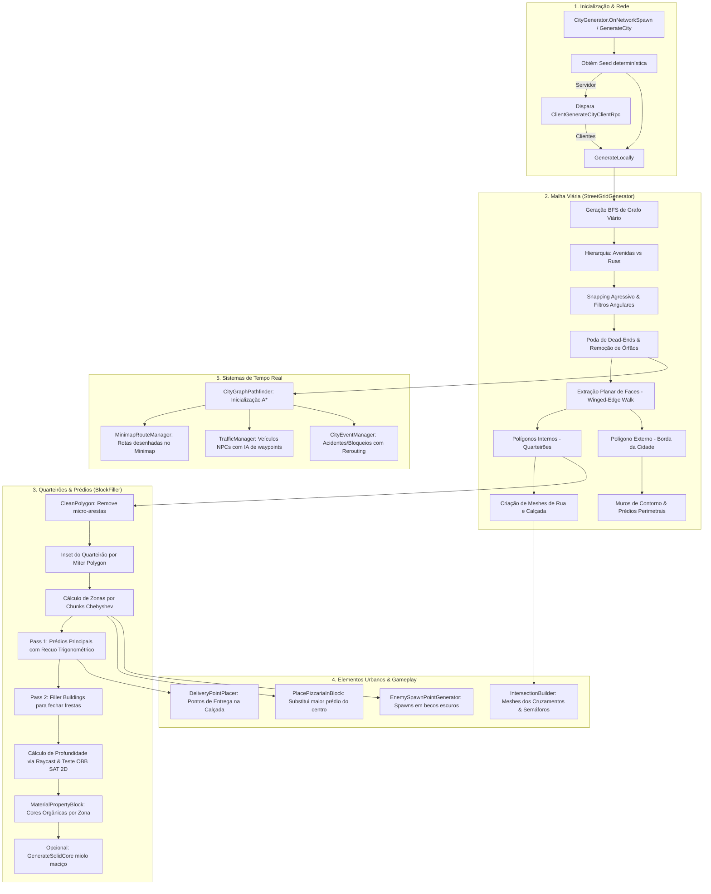
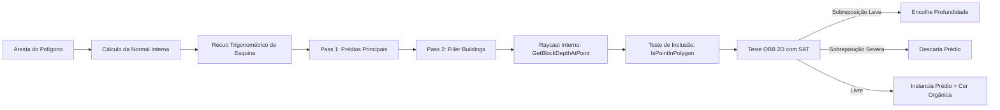

# 🏙️ Arquitetura e Funcionamento do Sistema de Geração de Cidades (ScaryParty)

Este documento apresenta uma análise técnica completa e aprofundada de todo o ecossistema de **geração procedural de cidades** do projeto *ScaryParty*. O sistema é responsável por sintetizar em tempo de execução (ou em tempo de edição) uma metrópole coesa, navegável, dividida em zonas de perigo concêntricas e 100% sincronizada em rede para partidas multiplayer cooperativas.

---

## 1. Visão Geral e Filosofia do Sistema

O objetivo central do gerador é fornecer um cenário dinâmico para o loop de jogabilidade: os jogadores começam na **Pizzaria central**, pegam pedidos e devem navegar pelas ruas para realizar entregas em residências e comércios espalhados pela cidade, enquanto evitam veículos no trânsito, bloqueios de ruas dinâmicos e monstros que habitam as zonas mais afastadas.

### Pilares de Design
1. **Malha Urbana Orgânica ("Estilo São Paulo / Fractured Grid"):** Em vez de uma grade perfeitamente ortogonal monótona (estilo Manhattan), o sistema combina múltiplos ângulos globais com pequenas perturbações angulares e regras rígidas de fechamento de ciclos para gerar quarteirões poligonais irregulares, porém críveis.
2. **Garantia de Ciclos Fechados (Sem Becos Isolados):** Ruas mortas que não formam quarteirões fechados são podadas agressivamente (*dead-end pruning*).
3. **Envelopamento Perimetral Denso:** Os edifícios são alinhados estritamente na borda dos quarteirões com suas fachadas viradas para a calçada, criando uma barreira contínua visual (paredes de prédios sem frestas indesejadas).
4. **Zonificação Concéntrica e Progressão de Perigo:** A cidade se expande a partir da origem `(0, 0, 0)` em anéis calculados pela métrica de Chebyshev (distância máxima em eixos ortogonais), organizando zonas de segurança e perigo:
   - **Centro (1x1 Chunks):** Comercial (onde fica a Pizzaria).
   - **Intermediário (3x3 Chunks):** Residencial.
   - **Periferia (5x5 Chunks):** Industrial.
   - **Bordas Externas:** MonsterZone (perigo crítico e alta concentração de inimigos).
5. **Determinismo em Rede (Server-Authoritative):** O servidor escolhe uma semente aleatória (`seed`) e a transmite aos clientes via `ClientRpc`. Cada cliente reconstrói localmente a geometria idêntica sem necessidade de enviar megabytes de malhas pela rede.

---

## 2. Diagrama de Arquitetura e Fluxo de Execução

---

## 3. Estrutura de Arquivos e Módulos

Todos os scripts do sistema estão localizados em `Assets/Scripts/City/`:

| Script | Tipo | Função Principal |
| :--- | :--- | :--- |
| **`CityConfig.cs`** | `ScriptableObject` | Concentra todos os parâmetros editáveis no Inspector (Odin Inspector): dimensões de ruas, prédios, zonas, trânsito, eventos e reconstrução em tempo real. |
| **`CityData.cs`** | `ScriptableObject` / DTO | Fonte da verdade dos dados em tempo de execução: grafo viário (`StreetGraph`), quarteirões (`BlockInfo`), pontos de entrega, spawns e consultas espaciais. |
| **`CityGenerator.cs`** | `NetworkBehaviour` | Orquestrador principal. Controla o ciclo de vida, instanciação da hierarquia, sincronização de rede, insetting de quarteirões e alocação da pizzaria. |
| **`StreetGridGenerator.cs`** | `MonoBehaviour` | Algoritmo de crescimento da malha viária, snapping, poda de becos sem saída, extração das faces do grafo planar, geração de asfalto/calçadas e muralhas externas. |
| **`IntersectionBuilder.cs`** | `MonoBehaviour` | Gera as geometrias poligonais de junção nos cruzamentos conectando todas as ruas sem falhas e instancia semáforos. |
| **`BlockFiller.cs`** | `MonoBehaviour` | Preenche o perímetro de cada quarteirão com prédios procedurais, usando cálculo trigonométrico em esquinas, raycast interno e teste de colisão OBB 2D (SAT). |
| **`CityBuilding.cs`** | `MonoBehaviour` | Componente anexado a cada prédio. Guarda metadados (zona, cor, porta de entrada calculada, elegibilidade para pizza). |
| **`DeliveryPointPlacer.cs`** | `MonoBehaviour` | Instancia os pontos de entrega (cilindros brilhantes) nas calçadas em frente às portas dos edifícios. |
| **`DeliveryPoint.cs`** | `MonoBehaviour` | Lógica interativa de entrega (`IInteractable`). Trata animação flutuante, verificação de inventário de pizza e notifica o `PizzariaManager`. |
| **`EnemySpawnPointGenerator.cs`** | `MonoBehaviour` | Calcula e armazena pontos de spawn de monstros concentrados em zonas industriais e na MonsterZone. |
| **`CityGraphPathfinder.cs`** | `MonoBehaviour` | Implementação do algoritmo A* sobre o grafo de ruas. Trata bloqueios dinâmicos e adiciona cantos ortogonais (Manhattan) nas extremidades. |
| **`TrafficManager.cs`** | `NetworkBehaviour` | Gerenciador de tráfego de carros NPCs (autoridade do servidor). Cuida do spawn, sincronização por RPC e rotas. |
| **`TrafficVehicle.cs`** | `MonoBehaviour` | Comportamento individual dos carros: navegação de waypoints, frenagem diante de semáforo vermelho ou de outro veículo à frente via raycast. |
| **`TrafficLight.cs`** | `MonoBehaviour` | Semáforo procedural com ciclo Verde ➔ Amarelo ➔ Vermelho sincronizado via `MaterialPropertyBlock`. |
| **`CityEventManager.cs`** | `NetworkBehaviour` | Eventos dinâmicos aleatórios (acidentes, obras, ataques de monstro) que bloqueiam arestas no grafo e alteram o trânsito e as rotas em tempo real. |
| **`CityGizmos.cs`** | `MonoBehaviour` | Desenho avançado no Scene View de nós, arestas, zonas, contornos dos quarteirões, spawns e pizzaria. |
| **`Editor/CityGeneratorEditor.cs`** | `Editor` | Custom Inspector do `CityGenerator` com sliders rápidos e botão de Quick Rebuild. |
| **`Editor/CitySceneBuilder.cs`** | `EditorWindow` | Janela completa de configuração de cena ("Scary Party Scene Builder"): gera configs, configura câmeras, luzes, materiais e rede em um clique. |

---

## 4. Análise Técnica Detalhada dos Componentes

### 4.1. Configuração e Controle (`CityConfig.cs`)
- Gerenciado via **Odin Inspector** com suporte a abas temáticas (`Geometria e Chunks`, `Construções`, `Progressão e Zonas`, `Trânsito e Eventos`).
- **Geração em Tempo Real:** O método `OnValidate()` detecta alterações nos sliders do Inspector e, se `gerarEmTempoReal` for verdadeiro e a aplicação estiver fora do Play Mode, agenda a reconstrução da cidade imediatamente via `EditorApplication.delayCall`.
- Validações de limites protegem contra valores nulos ou degenerados (ex.: larguras negativas, alturas mínimas maiores que máximas, etc.).

### 4.2. Estrutura de Dados do Grafo e Quarteirões (`CityData.cs`)
Define a base geométrica da cidade:
- `StreetNode`: id, posição no mundo (`Vector3`) e lista de arestas conectadas (`connectedEdges`).
- `StreetEdge`: id, `nodeA`, `nodeB`, comprimento, `isBlocked` (flag para eventos dinâmicos) e `streetType` (`Avenue` ou `Street`).
- `BlockInfo`: polígono perimetral (`Vector3[] polygon`), centróide (`worldCenter`), dimensões (`size`), tipo de zona (`ZoneType`), área calculada e flag `hasPizzaria`.
- Métodos utilitários espaciais como `GetNearestIntersection()` e `IsStreetAt()`.

### 4.3. Algoritmo de Geração da Malha Viária (`StreetGridGenerator.cs`)

O algoritmo viário substitui grades simples por uma rede expansiva baseada em busca em largura (BFS):

1. **Ângulos Fraturados (Fractured Grid):**
   Usa um conjunto de ângulos base: `0°`, `90°`, além de um ângulo aleatório adicional e seu perpendicular. Isso produz duas orientações ortogonais concorrentes que colidem, dando o efeito de bairros cortados característico de grandes capitais.
2. **Hierarquia Viária:**
   - **Avenidas:** Geradas principalmente a partir da origem ou com 20% de chance. Possuem comprimento 1.5x maior (`maxStreetBranchLength * 1.5f`) e largura expandida (`streetWidth * 1.5f`).
   - **Ruas Locais:** Mais curtas, conectando o miolo dos bairros.
3. **Snapping Agressivo:**
   Quando a ponta de uma nova rua chega a uma distância de até `30m` (avenida) ou `40m` (rua) de um nó existente, ela se conecta forçadamente a esse nó, evitando ruas mortas e criando interseções em T ou em cruz.
4. **Filtros de Validação e Anti-Fatia de Pizza:**
   - **Colisão de Segmentos:** Testa se a nova aresta cruza alguma aresta existente (`SegmentsIntersect`).
   - **Distância de Segurança:** Testa se a aresta passa muito perto de nós existentes (`DistPointSegment < 10m`).
   - **Ângulo Mínimo de 45°:** Se o novo ramo formar um ângulo menor que `45°` com qualquer rua conectada no nó de origem ou destino, ele é sumariamente descartado. Isso impede quarteirões em formato de "fatia de pizza" ultrafina.
5. **Poda Iterativa de Becos sem Saída (Dead-End Pruning):**
   Um laço `while` contabiliza o grau de cada nó (`nodeDegrees`). Qualquer aresta que termine em um nó de grau 1 (ponta solta) tem seu comprimento invalidado (`-1f`). O processo se repete recursivamente até que **todas as ruas pertençam a pelo menos um ciclo fechado**.
6. **Remoção de Nós Órfãos:**
   Nós isolados são removidos e todos os IDs de nós e arestas são reindexados de forma contígua.
7. **Extração Planar de Faces (`ExtractFaces`):**
   - Cria uma lista de adjacência ordenada angularmente no plano XZ (`Mathf.Atan2(dir.z, dir.x)`).
   - Realiza uma travessia de grafos planares no sentido anti-horário (sempre virando à esquerda/próxima aresta ordenada).
   - Identifica todas as faces fechadas. A face com a maior área é o **perímetro externo** da cidade (`outerPerimeter`), e todas as outras faces são os **quarteirões** (`blockPolygons`).
8. **Muralhas e Edifícios de Borda:**
   Ao longo do `outerPerimeter`, calcula-se o polígono de contorno expandido usando vetores Miter normais. São gerados muros altos escuros (`BorderWall`) e uma fileira de prédios externos voltados para a cidade, contendo o jogador dentro dos limites navegáveis.

### 4.4. O Algoritmo de Preenchimento dos Quarteirões (`BlockFiller.cs`)

O `BlockFiller` é o componente mais refinado matematicamente do sistema, responsável por preencher o interior dos quarteirões poligonais sem deixar frestas e sem permitir que edifícios colidam entre si ou invadam a rua.

#### Detalhes Matemáticos:
1. **Normal Interna e Sentido Horário/Anti-Horário:**
   Determina para qual lado do segmento fica o interior do quarteirão comparando a distância dos dois vetores perpendiculares normais até o centróide do polígono.
2. **Margem Trigonométrica de Esquinas:**
   Para evitar que prédios em arestas adjacentes se entrelacem na quina do quarteirão:
   $$\text{margin} = \max\left(\text{blockCornerMargin}, \frac{\text{maxBuildingDepth}}{\tan(\frac{\theta}{2})}\right)$$
   Onde $\theta$ é o ângulo interno da esquina. Se o ângulo for muito agudo, a margem de recuo aumenta proporcionalmente.
3. **Varredura em Dois Passos (Two-Pass Packing):**
   - **Passo 1:** Aloca edifícios normais (larguras entre `minBuildingWidth` e `maxBuildingWidth`).
   - **Passo 2:** Percorre novamente as arestas preenchendo qualquer espaço residual com prédios pequenos de preenchimento (*fillers* de 2 a 5 metros de largura), garantindo uma fachada contínua (*gap zero*).
4. **Cálculo da Profundidade por Raycast Poligonal (`GetBlockDepthAtPoint`):**
   Dispara um raio do ponto da calçada na direção da normal interna contra todos os outros lados do polígono. Se o quarteirão for estreito ou triangular, o raio encontra a aresta oposta e limita a profundidade do edifício (`bDepth`), impedindo que o fundo do prédio atravesse a rua do outro lado.
5. **Verificação de Vértices Traseiros (`IsPointInPolygon`):**
   Testa se os cantos traseiro-esquerdo e traseiro-direito da construção continuam estritamente dentro do polígono antes da instanciação.
6. **Colisão OBB 2D via SAT (Separating Axis Theorem):**
   Cada prédio é tratado como uma caixa orientada 2D (*Oriented Bounding Box*). Antes de posicionar, testa seus 4 eixos contra todos os prédios já posicionados no mesmo quarteirão. Caso haja uma pequena penetração no eixo de profundidade, o script encolhe dinamicamente o edifício; caso a sobreposição seja severa ou lateral, a peça é descartada.
7. **Coloração Orgânica por Zona:**
   Cada zona tem paletas HSV distintas aplicadas com variações aleatórias controladas via `MaterialPropertyBlock`:
   - **Residencial:** Predominância de tons azuis/frios.
   - **Comercial:** Tons quentes amarelados e alaranjados de maior saturação.
   - **Industrial:** Tons enferrujados, marrons e cinzas escuros com baixa saturação.
   - **MonsterZone:** Tons púrpuras, roxos e escuros saturados.
   - **Realismo:** 15% de chance de qualquer prédio ser gerado em tons neutros (cinza, grafite ou branco).

### 4.5. Construção de Cruzamentos (`IntersectionBuilder.cs`)
- Agrupa todas as ruas que convergem em um nó (`StreetNode`).
- Ordena as ruas no sentido horário usando $\text{atan2}(z, x)$.
- Para cada par de ruas adjacentes, calcula a interseção exata entre suas retas de borda externas via interseção linear 2D.
- Gera uma malha procedural em forma de leque (*triangle fan*) centralizada no nó com UVs normalizados e atribui uma `MeshCollider` convexa em modo *trigger*.
- Com base na probabilidade de configuração (`trafficLightProbability`), posiciona postes de semáforos em cruzamentos com 3 ou mais vias conectadas.

### 4.6. Posicionamento Estratégico da Pizzaria
A Pizzaria é o ponto nevrálgico do jogo e é posicionada automaticamente por `PlacePizzariaInBlock`:
1. Avalia todos os quarteirões da cidade calculando uma pontuação:
   $$\text{Score} = \text{Distância ao Centro} + \text{Penalidade de Zona}$$
   Onde a zona comercial tem penalidade 0, residencial 20, industrial 50 e MonsterZone 100.
2. Identifica o quarteirão vencedor (o mais central e comercial possível).
3. Dentro desse quarteirão, busca o edifício de maior volume (`largura × altura × profundidade`).
4. **Destrói o edifício e assume sua vaga exata**, mantendo a rotação, orientação para a rua e calçada.
5. Instancia a estrutura avermelhada da pizzaria, a placa luminosa amarela, a **bancada de pizzas** e o objeto de spawn de rede dos jogadores (`NetworkSpawnPoint`).

### 4.7. Sistema de Navegação e Pathfinder (`CityGraphPathfinder.cs`)
- Constrói a topologia a partir de `StreetGraph`.
- **A\* Pathfinding:** Utiliza uma fila de prioridade com `SortedSet<AStarNode>` e heurística Manhattan.
- **Detecção de Bloqueios:** Suporta arestas bloqueadas dinamicamente (`isBlocked = true`), que são ignoradas pelo algoritmo de roteamento.
- **Conexões Manhattan nas Pontas (`GetManhattanCorner`):** Quando a origem ou destino estão fora do nó exato (ex.: uma entrega no meio do quarteirão), o pathfinder insere um ponto ortogonal intermediário a 90 graus para que a linha siga a calçada em vez de cortar prédios em linha reta.

### 4.8. Sistema de Tráfego NPC (`TrafficManager.cs`, `TrafficVehicle.cs`, `TrafficLight.cs`)
- **Server-Authoritative:** O servidor faz a simulação física e movimentação dos carros; clientes recebem estados empacotados (`VehicleState`) via `SyncVehiclesClientRpc` e realizam interpolação suave (*Lerp/Slerp*).
- **Direção Autônoma:** Os veículos escolhem nós de destino aleatórios no grafo e obtêm o caminho via `CityGraphPathfinder`.
- **Sensores Frontais por Raycast:**
  - `CheckTrafficLight()`: Detecta se há um semáforo no cruzamento à frente no estado Vermelho.
  - `CheckVehicleAhead()`: Detecta outro carro à frente e aciona desaceleração gradual/frenagem para evitar batidas em fila.
- **Semáforos Cíclicos:** Ciclam entre Verde ➔ Amarelo ➔ Vermelho atualizando cores emissivas via `MaterialPropertyBlock`.

### 4.9. Eventos Urbanos Dinâmicos (`CityEventManager.cs`)
- Executado exclusivamente no servidor, disparando eventos a intervalos aleatórios (`minEventInterval` a `maxEventInterval`).
- Escolhe uma aresta livre do grafo e aplica um tipo de evento:
  - `"accident"`: Carros acidentados bloqueando a via.
  - `"construction"`: Cones e bloqueios de obras na pista.
  - `"monster_attack"`: Uma gosma/massa escura indicando perigo biológico.
- Marca a aresta no `CityGraphPathfinder` como bloqueada e força o `TrafficManager` a recalcular a rota de todos os carros afetados.
- Sincroniza a criação e destruição dos obstáculos visuais com os clientes via RPCs (`TriggerEventClientRpc` e `RemoveEventClientRpc`).

### 4.10. Integração com Gameplay e Minimapa
- **`PizzariaManager.cs`:** Escuta o evento `OnCityGenerated`. Assim que a cidade está pronta e possui pontos de entrega válidos, inicia a rodagem dos pedidos de pizza e libera os controles dos jogadores (`IsGameStarted = true`).
- **`MinimapRouteManager.cs`:** Consulta o `CityGraphPathfinder` para desenhar linhas coloridas brilhantes elevadas no ar (`lineElevation = 15f`) com `LineRenderer` e shader `Hidden/Internal-Colored`, guiando o motoboy do ponto de partida até a casa do cliente.

---

## 5. Tabela de Parâmetros de Configuração (`CityConfig`)

| Parâmetro | Tipo | Padrão | Descrição e Impacto |
| :--- | :---: | :---: | :--- |
| `gerarEmTempoReal` | `bool` | `true` | Reconstrói a cidade no Editor instantaneamente ao mexer em qualquer controle. |
| `generateBorderWalls`| `bool` | `true` | Constrói a grande muralha ao redor da cidade e prédios de borda voltados para dentro. |
| `generateSolidCore` | `bool` | `false` | Preenche o centro oco dos quarteirões com um bloco geométrico cinza fechado. |
| `seed` | `int` | `0` | Semente numérica para reproducibilidade. `0` = gera uma nova cidade a cada build. |
| `gridWidth` / `gridHeight`| `int` | `6` | Quantidade de chunks horizontais e verticais que delimitam a dimensão do grafo viário. |
| `minStreetBranchLength` | `float` | `30f` | Comprimento mínimo de um segmento de rua local. |
| `maxStreetBranchLength` | `float` | `80f` | Comprimento máximo de um segmento de rua (base do tamanho de um chunk). |
| `streetWidth` | `float` | `12f` | Largura da pista asfáltica em metros. |
| `sidewalkWidth` | `float` | `2f` | Largura das calçadas laterais. |
| `minBuildingWidth` | `float` | `4f` | Largura mínima da fachada de um prédio principal. |
| `maxBuildingWidth` | `float` | `15f` | Largura máxima da fachada de um prédio principal. |
| `minBuildingDepth` | `float` | `8f` | Profundidade mínima dos lotes. |
| `maxBuildingDepth` | `float` | `20f` | Profundidade máxima dos lotes. |
| `blockCornerMargin` | `float` | `2f` | Recuo básico das quinas para evitar invasões entre ruas perpendiculares. |
| `minBuildingHeight` | `float` | `5f` | Altura mínima dos edifícios. |
| `maxBuildingHeight` | `float` | `30f` | Altura máxima dos edifícios centrais. |
| `pizzariaInsideBlock` | `bool` | `true` | Se ativo, substitui um prédio no melhor quarteirão pela Pizzaria. |
| `maxEnemySpawnPointsPerZone` | `int` | `3` | Quantidade máxima de monstros que podem spawnar por quarteirão de perigo. |
| `minDeliveryPointsPerBlock` | `int` | `0` | Mínimo de pontos de entrega por quarteirão. |
| `maxDeliveryPointsPerBlock` | `int` | `3` | Máximo de pontos de entrega por quarteirão. |
| `maxTrafficVehicles` | `int` | `10` | Quantidade máxima simultânea de carros NPCs trafegando. |
| `trafficBaseSpeed` | `float` | `8f` | Velocidade de cruzeiro dos carros NPCs. |
| `trafficLightProbability` | `float` | `0.5f` | Chance de um cruzamento de 3 ou mais vias receber semáforo funcional. |
| `minEventInterval` | `float` | `30f` | Tempo mínimo (segundos) entre ocorrências de bloqueio de via. |
| `maxEventInterval` | `float` | `90f` | Tempo máximo (segundos) entre ocorrências de bloqueio de via. |
| `blockadeDuration` | `float` | `45f` | Duração de cada evento de rua bloqueada antes de ser liberada. |

---

## 6. Edge Cases Tratados e Resolução de Problemas

Durante a evolução do gerador (versão 4.0), diversos desafios geométricos e de rede foram solucionados:

1. **Colapso de Miter e "Pizza Slices":**
   - *Problema:* Cruzamentos com ângulos agudos (< 30°) geravam quarteirões estreitos demais onde prédios colidiam ou vetores de Miter explodiam para o infinito.
   - *Solução:* Foi adicionada a rejeição prévia de arestas com ângulo menor que 45° no `StreetGridGenerator` e um clamp rígido no vetor de Miter (`Mathf.Min(miterLength, inset * 3f)`).
2. **Arestas Microscópicas e Vértices Colineares:**
   - *Problema:* Pequenas imprecisões no corte de faces geravam vértices a centímetros de distância ou colineares que invertiam a normal do polígono.
   - *Solução:* O método `CleanPolygon` faz duas passagens limpando vértices com distância menor que 1 metro e fundindo segmentos com variação angular menor que 5 graus.
3. **Z-Fighting de Calçadas e Ruas:**
   - *Problema:* Calçadas ultrapassavam a esquina e piscavam visualmente com a malha da interseção.
   - *Solução:* O comprimento da calçada é reduzido em relação à rua (`length - config.streetWidth`), e as interseções recebem uma elevação suave de `+0.02m`.
4. **Perda de Cores no Play Mode:**
   - *Problema:* `MaterialPropertyBlock` aplicados em Edit Mode pelo Unity não sobrevivem à transição para o Play Mode em alguns objetos.
   - *Solução:* O componente `CityBuilding` serializa o campo `buildingColor` e, em seu método `Start()`, reaplica o bloco de propriedades se estiver em jogo.
5. **Race Condition de Conexão Multiplayer:**
   - *Problema:* Se o `PizzariaManager` ou os jogadores nascessem antes ou depois do `CityGenerator` disparar o `ClientRpc`, os pedidos nunca iniciavam ou os jogadores nasciam embaixo do mapa.
   - *Solução:* O `CityGenerator` executa `TeleportPlayersToSpawn()`, e o `PizzariaManager` checa se `CityData.DeliveryPointCount > 0` logo no seu `OnNetworkSpawn()`, iniciando o jogo imediatamente caso a cidade já esteja pronta.

---

## 7. Como Usar no Unity Editor

1. **Abrir a Ferramenta:** No menu superior do Unity, clique em **Tools > Scary Party > Scene Builder**.
2. **Setup Rápido:** Clique em **🚀 Full Setup** para criar a hierarquia completa de objetos, configurar iluminação, planos de chão, o gerador de cidade e a rede.
3. **Ajuste Fino:**
   - Selecione o objeto `__City__` na cena.
   - Ajuste as dimensões de `Grid Width` e `Grid Height` no Inspector do `CityGenerator`.
   - Clique em **🏗️ Quick Rebuild City** para testar diferentes seeds.
4. **Modo Jogo (Play Mode):** Ao iniciar o jogo no Host/Server, a cidade é sintetizada automaticamente e os clientes que se conectarem receberão a seed e construirão a mesma cidade em milissegundos.
