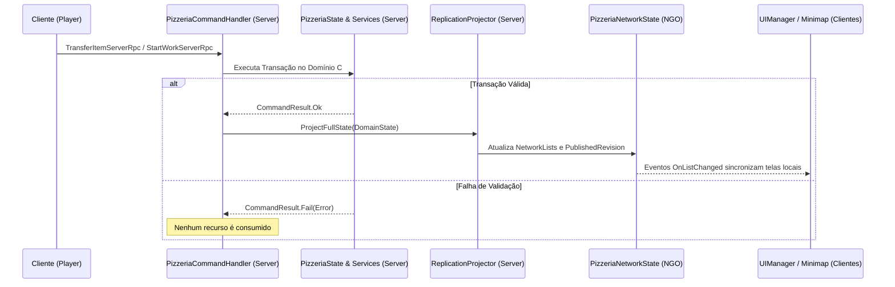

# ScaryParty — Arquitetura do Módulo Pizzaria

Documentação arquitetural de referência para engenheiros do projeto **ScaryParty**.

---

## 1. Princípios Arquiteturais e Separação de Camadas

O módulo é construído sob uma **arquitetura limpa desacoplada**, dividida em 4 camadas bem delimitadas:

```
[ Domain (C# Puro) ] <--- [ Authoring (ScriptableObjects) ]
        ^
        |
[ Network (NGO) ] <--- [ Integration & Presentation ]
```

1. **Domain (`ScaryParty.Pizzeria.Domain.asmdef`)**:
   - `noEngineReferences: true` — Zero dependência de Unity Engine, GameObject, Transform ou NGO.
   - Contém os modelos de dados mutáveis (`ItemState`, `ToolItemState`, `OrderState`, `OperationState`, `PizzeriaState`), tipos (`ItemId`, `LocationRef`, `CommandResult`), catálogo imutável (`DefinitionCatalog`) e serviços de domínio (`TransferService`, `ProcessingService`, `RecipeEvaluator`, `DeliveryEvaluator`, `OrderService`, `UpgradeService`).
   - Permite testes unitários instantâneos sem overhead de Play Mode.

2. **Authoring (`ScaryParty.Pizzeria.Authoring`)**:
   - ScriptableObjects que vivem em `Assembly-CSharp` (`IngredientDef`, `RecipeDef`, `ToolDef`, `ProcessDef`, `StationDef`, `SupplyItemDef`, `UpgradeDef`, `PizzeriaConfig`).
   - O método `PizzeriaConfig.BuildCatalog()` compila os dados dos assets em um `DefinitionCatalog` puro em memória no início da sessão.

3. **Network (`ScaryParty.Pizzeria.Network`)**:
   - `PizzeriaNetworkState`: hospeda coleções de `NetworkList<T>` unmanaged (`NetItemDto`, `NetToolDto`, `NetOrderDto`, etc.) e `PublishedRevision`.
   - `PizzeriaCommandHandler`: ponto de entrada de todos os comandos de cliente via `[ServerRpc(RequireOwnership = false)]`.
   - `ReplicationProjector`: único escritor nas `NetworkList`s, projetando o estado confirmado do domínio para os clientes.

4. **Integration & Presentation**:
   - `CityPizzeriaPlacementAdapter`: reserva de lote e spawn único do prefab na cidade.
   - `CargoMapAdapter`: projeta no minimapa do jogador apenas os destinos das caixas em sua posse.
   - `DeliveryPointAdapter`: intercepta entregas na cidade e envia `SubmitDeliveryServerRpc`.
   - `PlayerInventoryAdapter` & `BackpackController`: inventário autoritativo de duas mãos e mochila.

---

## 2. Invariantes de Dados e Transações Atômicas

1. **Invariante de Localização Única**:
   - Todo item e ferramenta possui exatamente um `LocationRef` (`Type`, `HolderId`, `SlotId`).
   - `TransferService` verifica se o destino está desocupado antes de mover o item da fonte. Nunca há dois objetos na mesma mão ou slot, nem itens órfãos.

2. **Utensílios Físicos Compartilhados e Leases**:
   - Utensílios (`ToolItemState`) possuem capacidade funcional (ex: `Grate`, `Slice`), quantidade inicial configurada e localização real no mundo/mão.
   - Durante o trabalho (`StartWork`), o servidor reserva a ferramenta para o `WorkerId` por um lease de 0,75s com heartbeat a cada 0,2s.
   - Outro jogador não pode roubar a ferramenta em uso; soltar a tecla `F` ou afastar-se pausa o processo, mantém o progresso acumulado na porção e libera o lock da ferramenta para outro jogador.

3. **Montagem e Cozimento Permissivos**:
   - A montagem de pizza aceita qualquer combinação de ingredientes alimentícios.
   - O forno assa qualquer pizza montada. Queimadura não bloqueia a embalagem nem a entrega.
   - O jogo não protege a equipe de erros: erros de receita ou pizza queimada são avaliados no momento da entrega pelo `DeliveryEvaluator`.

4. **Endereçamento Manual no Staging**:
   - Ao colocar uma caixa no `Station_Staging`, a UI abre a lista de endereços da cidade sem indicar qual é o pedido correto.
   - A caixa recebe apenas a etiqueta `LabelDestinationId`. Não existe `OrderId` oculto gravado na caixa.

---

## 3. Fluxo de Execução de um Comando de Rede



---

## 4. Avaliação de Entrega de Conjunto (`DeliveryEvaluator`)

Ao interagir com o `DeliveryPoint`, o entregador envia o lote de caixas carregadas:
1. O servidor localiza o pedido ativo do endereço via `OrderService`.
2. `DeliveryEvaluator` expande os requisitos do pedido em unidades solicitadas.
3. Realiza o pareamento ótimo por maior valor de receita:
   - Pizza correta e assada (`Baked`): 100% do valor da unidade.
   - Pizza queimada (`Burned`): 0% (ou percentual de penalidade configurado).
   - Pizza de receita errada ou incompleta: 0%.
4. Todas as caixas confirmadas são consumidas. O pedido é marcado como `Completed` e os créditos (pessoal no `PlayerState.Money` e corporativo no caixa da pizzaria) são concedidos imediatamente na mesma transação.
